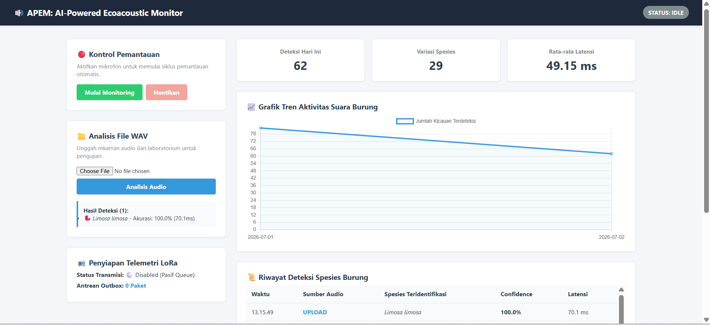
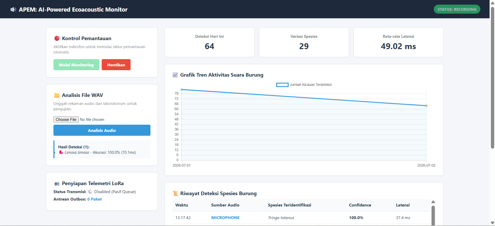

# 🌿 APEM (AI-Powered Ecoacoustic Monitor)




APEM adalah sistem **Edge Computing** untuk monitoring bioakustik yang dirancang untuk mendeteksi suara burung secara otomatis menggunakan model **BirdNET TensorFlow Lite (TFLite)**. Sistem mendukung **offline inference**, **real-time monitoring**, **SQLite Database**, **Web Dashboard**, serta arsitektur **Outbox Pattern** yang dipersiapkan untuk komunikasi **LoRa** pada perangkat **Radxa** maupun **Raspberry Pi**.

> **Status:** 🚧 Active Development (v1.0.0-beta)

---

## ✨ Features

- 🎙️ Real-time audio monitoring menggunakan microphone
- 📂 Audio file inference (.wav)
- 🧠 BirdNET TensorFlow Lite inference
- 💾 SQLite Database untuk menyimpan hasil deteksi dan monitoring session
- 📊 Web Dashboard berbasis FastAPI
- 🔄 REST API
- ⚡ Duty Cycle monitoring untuk efisiensi daya
- 📡 LoRa-ready architecture menggunakan Outbox Pattern
- 🌱 Edge deployment pada Radxa dan Raspberry Pi

---

## 🏗️ System Architecture

```text
Audio Source (Microphone / Audio File)
               │
               ▼
          Audio Loader
               │
               ▼
    TensorFlow Lite Inference
               │
               ▼
        Post Processing
               │
               ▼
         SQLite Database
         ├──────────────┐
         ▼              ▼
   Web Dashboard    LoRa Queue
```

---

## 📂 Project Structure

```text
src/
├── api/          # REST API endpoints
├── audio/        # Audio acquisition & preprocessing
├── controller/   # Application controller
├── core/         # Configuration, Logger, Inference Engine, Storage
├── models/       # Domain models (Session, Detection, LoRaPacket)
└── services/     # Background services (Monitor, Dashboard, LoRa)
```

---

## 🚀 Quick Start

```bash
# Clone repository
git clone https://github.com/dsisme-1/APEM.git

cd APEM

# Create Virtual Environment
python -m venv .venv

# Windows
.venv\Scripts\activate

# Linux / Radxa
source .venv/bin/activate

# Install dependencies
pip install -r requirements.txt

# Run application
python run.py
```

Buka browser:

```
http://127.0.0.1:8000
```

---

## 📋 Roadmap

- ✅ Audio file inference
- ✅ BirdNET TensorFlow Lite integration
- ✅ SQLite Database
- ✅ Web Dashboard
- ✅ REST API
- ✅ Refactoring Architecture
- ✅ Real-time monitoring
- ✅ Stateless Detector
- ✅ Monitoring Session
- ✅ State Machine
- ✅ Duty Cycle
- 🔄 LoRa Service
- 🔄 Edge deployment

---

## Credits

APEM menggunakan model **BirdNET TensorFlow Lite** untuk proses identifikasi suara burung.

BirdNET dikembangkan oleh:

- Cornell Lab of Ornithology
- Chemnitz University of Technology
- K. Lisa Yang Center for Conservation Bioacoustics

GitHub:
https://github.com/birdnet-team/BirdNET-Analyzer

Models:
https://zenodo.org/records/15050749 

Jika Anda menggunakan model BirdNET dalam penelitian atau publikasi, mohon mengacu pada dokumentasi dan publikasi resmi BirdNET.

---

## 📄 License

Kode sumber APEM dilisensikan di bawah **MIT License**.

Model **BirdNET TensorFlow Lite** **tidak** termasuk dalam lisensi MIT proyek ini dan tetap mengikuti lisensi serta ketentuan penggunaan dari pengembang BirdNET.

Silakan lihat dokumentasi resmi BirdNET untuk informasi lebih lanjut mengenai penggunaan model.

## Author
Developed by **David Suharjanto**
